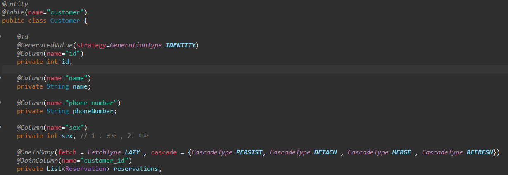
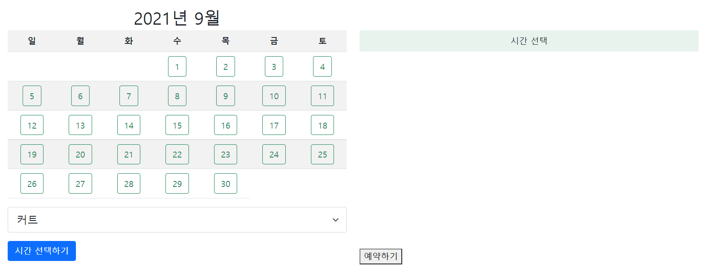
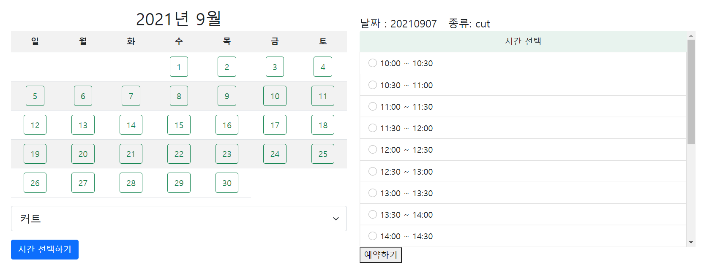

# SH hair 예약 사이트 프로젝트 

## 프로젝트 소개

| 카테고리 | 설명                                                         |
| -------- | ------------------------------------------------------------ |
| 목표     | 미용실 예약 사이트 개설                                      |
| 시작동기 | 전화로 예약이 이루어지는 시스템에 불편함을 느껴 이를 해결하고자 함 |
| 사용기술 | ▮ java ▮ spring ▮ jsp▮ bootstrap                             |
| 기간     | 2021.07 ~                                                    |
| 진행상황 | - 개체 생성 및 DB 연결 - Service을 통한 CRUD 서비스 생성 - Spring Security와 jwt token 구현을 통한 사용자 인증 - jsp와 bootstrap으로 예약 페이지 구현 |

## 프로젝트 진행 과정

### 1. 개체 정의 및 JDBC를 통한 DB 연결

​	예약 사이트에 필요한 개체와 그 속성들을 정의하고 이를 jdbc를 통해 spring 서버와 database를 연결하였다. 개체는 예약에 필요한 `예약`과 `고객` 그리고 로그인에 필요한 `로그인 정보` 이 3가지를 생성하였다. 이 3가지의 속성과 관계는 다음과 같다.

​	reservation은 예약 정보가 담긴 개체로써 예약 회원, 예약 종류, 날짜, 시간, 종료의 속성을 가지고 있다. customer은 손님 정보가 담긴 개체로 이름, 번호, 성별에 대한 속성을 가진다. 또한 각 미용 종류별 소요 시간에 대한 정보를 추가하여 미용사가 손님별로 예상 종료 시간을 변경할 수 있도록 설정했다. logininfo는 로그인 정보로, id와 password 그리고 회원 정보에 대한 속성을 담았다. 

​	이후 해당 table과 대응되는 java 클래스를 생성하고, 각각 대응되는 테이블과 연결하였다.

 [테이블과 연결한 java 클래스 코드의 일부]  
				  

### 3. 개체들의 인스턴스를 직접적으로 관리할 각각의 DAO 클래스 생성

​	DB에 저장되어 있는 데이터 항목을 Spring에서 조작할 수 있도록 DAO (Data Access Object) 클래스를 생성하였다. Spring에서 제공하는 EntityManager 객체를 통하여 db에 실질적으로 접근하고 조작하는 코드를 작성하였다. 

 [DAO 클래스 코드의 일부]  
				  

### 3. CRUD와 필요 기능들을 통합하여 제공할 Service 클래스 생성

​	각각의 DAO 객체가 수행하는 데이터에 대한 생성, 읽기, 수정, 삭제할 작업을 Service 클래스를 통해서 하나로 통합하였다. 또한 예약 날짜를 선택하였을 때, 그 날짜에 가능한 시간대를 반환하는 메소드와 같이 예약 사이트에 추가적으로 필요한 기능들을 Service 클래스에 넣어주었다. 

### 4.  Spring Security와 jwt 토큰 구현을 통한 보안 강화

​	POST 요청에 대한 인증 절차를 강화하여 보안 정도를 높이고, 사용자의 세션 관리를 하기 위해 기존 security 코드에 jwt 토큰을 구현하여 추가하였습니다. 작업 순서는 다음과 같다. 

1. SecurityConfig 에 user 정보 추가

   : 사용자가 로그인을 시도했을 때, db에서 연결된 로그인 정보를 통해 user 정보를 불러오도록 설정

2. jwt token 설정

   : 토큰을 생성하는 클래스를 구현하였으며,  token을 통해 사용자 정보와 인증 받은 시간을 입력받아 해당 사용자가 권한이 있는지, 혹은 인증 기간이 만료되진 않았는지를 확인한다.

3. 인증요청 클래스와 인증응답 클래스 생성

   : 인증 요청 클래스는 사용자 id와 password를 속성으로 가지며, 인증 응답 클래스는 jwt 토큰만을 속성으로 가진다. 이 두 클래스는 인증 메서드에서의 input과 output 값이 된다.

4. 인증 url에 인증 토큰 생성 메소드 매핑

   : Controller을 통해 url과 인증 메서드를 매핑한다. url에서 유저 정보를 받아 jwt 토큰을 반환

5. 권한에 따른 접근 허용

   : SecurityConfig 파일에서 권한에 따라 접근할 수 있는 url을 설정

6. 필터를 통한 모든 요청 검사

   : 들어오는 모든 요청마다 jwt 토큰을 확인하여 해당 토큰이 유효한지 확인하는 작업을 추가

### 5. jsp와 bootstrap으로 예약 페이지 구현

​	jsp 태그를 사용하여, 현재 날짜를 기준으로 현재 달의 달력을 나타내는 페이지를 구현하였습니다. 또한, 추후 예약 가능 시간을 요청하였을 때, 예약 가능 시간들이 나열되게끔 작성하였다. 

​	요소들의 배치는 bootstrap의 Grid system을 사용하여 작업하였다.

 [예약 페이지] 

### 6. 예약 요청 보내고 응답 받기

​	url과 매핑되는 Controller를 GET과 POST 요청에 따라 나누어 작성하였다. 작업의 순서는 다음과 같이 작성하였다.

	1. 사용자의 url 접근 (예약 페이지 GET 요청) 
	2. 원하는 날짜와 종류 선택 & 가능 시간 요청(GET) 
	3. Controller에서 해당 날짜에서 가능한 시간 list 반환 
	4. 사용자가 원하는 시간 선택 & 예약 요청(POST) 
	5. Controller에서 예약 생성 및 완료 페이지로 이동

	
 [예약 페이지에서 가능 시간 요청 결과] 

## 느낀점 및 배운점

- MVC 디자인 패턴의 구조를 이해할 수 있었다. 서버 개발 관련하여 첫 프로젝트라서, 시작할 때 구조를 잡는 것에서 어려움을 겪었다. 하지만 몇번씩 요청 페이지와 응답 컨트롤러의 관계와 model에 담을 데이터 구조를 바꾸면서 동작 원리를 이해할 수 있었다.
- 프로젝트 전 필요한 개체의 명확한 정의가 필요함을 느꼈다. 개체의 속성과 메서드를 사전에 명확하게 정의하지 않고 프로젝트를 진행하여, 중간에 빠진 기능들을 발견할 때마다 개체 클래스와 DB table을 수정하였다. 사전 설계 과정을 정확히 수행하는 것이 전체 프로젝트 효율을 높인다는 것을 깨달았다.
- 복잡한 개념도 천천히 공부하면 이해할 수 있음을 경험하였다. jwt 토큰과 같은 경우에도 처음에는 개념과 작동 원리에서 조차 이해가 되지 않았지만, 하나씩 코드를 뜯어보고 구현하는 과정을 통해서 이해할 수 있었다. 이외에도 jsp 태그, html form 등 알지 못했던 개념들을 프로젝트를 통해 공부하며 내 것으로 만들 수 있었다. 남은 프로젝트 과정 그리고 추후의 다른 프로젝트 과정에서도 모르는 문제가 발생하였을 때 문제를 해결 할 수 있는 문제 해결 능력을 기를 수 있었다.

