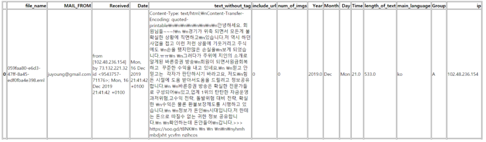
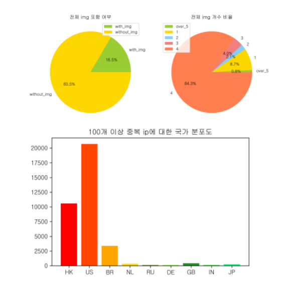
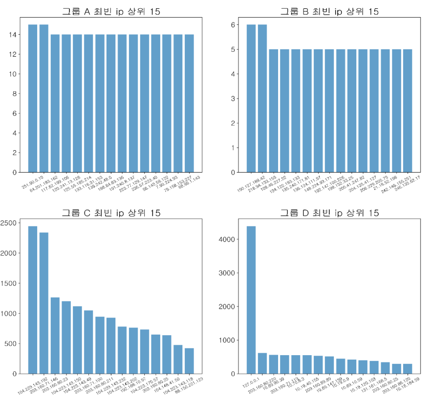
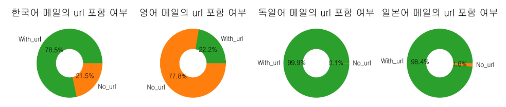
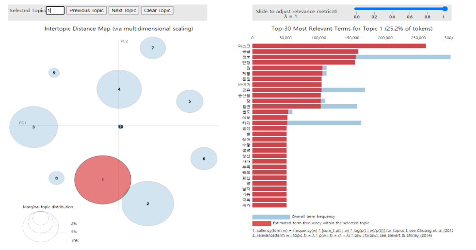
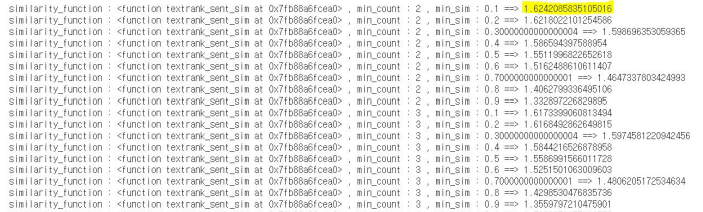

- # 자연어 처리 분야 빅데이터 분석 프로젝트

  ## 목차

  - 프로젝트 소개
  - k-cyber-security 빅데이터 부문 악성메일 분석 대회
    - 대회 소개
    - 수행 과정
    - 느낀점
  - Dacon 한국어 문서 추출 요약 AI 경진 대회
    - 대회 소개
    - 수행 과정
    - 느낀점
  - Dacon 한국어 문서 생성 요약 AI 경진 대회
    - 대회 소개
    - 수행 과정
    - 한계
    - 느낀점
  - 전체 프로젝트 저장 url

  

  ## 프로젝트 소개

   자연어는 일상생활에서 가장 많이 접하게 되는 데이터 중 한 영역이며, 적용 분야도 보안, 문서 요약, RPA, 챗봇 등 매우 다양하다. 이에 자연어 분석 기법을 익혀, 추후 일상생활에서의 효율성을 증대시키는 일로 발전시켜 나가고자 한다.
   본 프로젝트에서는 여러 자연어 처리 역량 중 아래 3가지를 목표로 진행하고자 한다. 1. 빅데이터 분석 절차 학습 2. 자연어 데이터 구조 학습 3. 딥러닝 모델 적용 
   이러한 목표를 달성하기 위해서는 각각의 능력이 요구되는 대회를 참여하여, 구체적인 방향성을 가지고 진행하는 것이 효율적이라 판단하였다. 이에 다음 3가지 대회에 참여하고자 한다 

   	1. k-사이버 시큐리티 챌린지 비정상 이메일 분석 
   	2. Dacon 한국어 문서 추출 요약 AI 경진 대회 
   	3.  Dacon 한국어 문서 생성 요약 AI 경진 대회 

   이 3가지 대회를 통하여, 목표로 잡은 3가지 역량을 기르고자 한다.

  

  ## k-cyber-security 빅데이터 부문 악성메일 분석 대회

  ### 대회 소개

  | 카테고리  | 설명                                                         |
  | --------- | ------------------------------------------------------------ |
  | 참여인원  | 조상혁, 문주혁, 조동수                                       |
  | 기술분야  | ▮ python ▮ 머신러닝                                          |
  | 주제영역  | ▮ 보안 ▮ 빅데이터 분석                                       |
  | 수행기간  | 20.10.01 ~ 20.10.30                                          |
  | 대회 소개 | 비정상 이메일(스팸메일, 악성메일 등) 빅데이터 분석을 통한 공격패턴 및 특징을 도출함. |
  | 도전 과제 | 1. 비정상 메일 데이터 간의 차이를 분석하여 비정상 메일의 속성 및 특징을 분류 2. 송신 그룹의 활동에 대해 이상 징후를 탐지하여 프로파일링 3. 분석결과를 시각화 |
  | 대회 진행 | 1. eml 파일을 분석을 위해 csv로 변환함 2. light gbm, 비지도 clustering 등 머신러닝 분석툴을 이용하여 악성메일 feature 추출 3. 추출한 주요 feature별로 추출한 분석 결과를 시각화하여 표현함 ex) 메일 사이즈, 그림 수, 언어, 메일 안 텍스트 분석 |

  

  ### 수행 과정

  #### 1. eml 파일 데이터의 csv 파싱

  ​	주어진 데이터의 형식이 eml 형식이었기에, 효율적인 분석을 위하여 70만개의 eml 파일을 하나의 csv 파일로 변환해줄 필요가 있었다. 이를 위해 다음과 같은 순서로 작업을 진행하였다.

  1. eml 파일들의 헤더 정보 수집

     : 각각의 eml 파일들이 가지고 있는 헤더의 키값들이 달라, eml 파일들에서 등장하는 모든 헤더이름을 수집 

  2. 데이터 통합 

     : 수집한 헤더이름과 본문의 내용들을 열 값으로 가지는 csv 파일을 생성하고, 해당 csv 파일에 모든 eml 파일을 통합 

  3. 데이터 편집 

     : 헤더 정보 중 등장 빈도와 신뢰도1 를 기준으로 MAIL_FROM(발신자), Received(수신정보), Date(발신일자)을 선별했으며, 이와 본문 정보를 가지는 csv 파일로 편집하였음. 

  4. 데이터 확장 

     : 편집된 데이터에서 분석에 필요하다 생각되는 정보들을 파생시켜 분석에 사용할 csv 파일을 형성함 

  

  ​	위 작업의 결과로, 분석에 필요한 헤더 정보만을 취합하여 하나의 csv 파일을 생성하였다. 

  

  
[최종 데이터 테이블의 샘플 데이터]

  

  #### 2. 전체 데이터에 대한 탐색적 데이터 분석 (EDA)

  ​	악성 메일 데이터의 전체적인 특징을 확인하기 위해 EDA 분석을 진행하였다. 새롭게 파생시킨 열 정보들을 기준으로 분석을 진행하였으며, 이를 통해 송신 그룹을 분류하고자 하였다. 분석은 크게 시간, url 여부, 이미지 개수, 본문 길이, 발신 국가, ip를 기준으로 진행하였으며, 시각화를 통해서 직관적으로 데이터의 특정을 확인하고자 하였다.

  

  

  
[전체 데이터 EDA 시각화 샘플]

  ​	위와 같은 분석을 진행한 결과 다음과 같은 결론을 도출할 수 있었다.

  - 악성 메일은 특정 기간 혹은 시기에 집중되어 발신되는 경향이 있음. 
  - 대다수의 악성메일이 url 링크를 포함하고 있었으며, 이미지가 포함된 악성 메일의 경우, 이미지의 개수가 골고루 분포하지 않고 특정 개수(4 개)에 집중되어 있음. 
  - 100 건 이상씩 반복적으로 악성 메일의 보내는 발신자의 경우 미국 혹은 홍콩에 집중되어 있음.

  #### 3. 송신 그룹 분류

  ​	악성 메일을 몇가지 특성을 기준으로 그룹을 분류한 후 EDA를 다시 진행한 다음, 전체 EDA 결과와 상이한 패턴이 존재하는지 확인하고자 하였다. 처음에는 발신자 아이디 만이 악성 메일의 송출 빈도를 나타내는 특성이라 생각하여, 아이디의 발신 빈도에 따라 그룹을 나누어 분석을 진행하였다. 하지만 분석 결과, 아이디의 발신 빈도가 낮은 그룹 또한 같은 ip에서 대량의 악성이 발송되고 있음을 확인할 수 있었다. 즉, 대부분의 악성 메일은 같은 발신자에 의해서 중복되며 발신되고 있었으며, 같은 id를 사용하는지나 같은 ip를 사용하는지에 대한 차이는 작성된 언어에 따라서 구분됨을 확인할 수 있었다. 이에 언어를 기준으로 송신그룹을 분류하였다. 

  

  ​	아이디의 발신 빈도에 따른 최빈 ip 주소의 등장 횟수를 나타내는 그래프이다. 이를 통해 아이디의 발신 빈도가 낮은 그룹은 같은 ip에서 여러개의 악성 메일을 보내고 있음을 알 수 있다.

  

  #### 4. 언어에 따른 송신 그룹 특징 분석

  ​	작성 언어에 따라 그룹을 나누어 분석을 진행하였다. 분석은 그룹별 EDA를 통해 전체 데이터와의 차이를 비교하였고, 통계적 추론으로 문서들의 토픽을 추출하는 LDA 모델을 사용하여, 그룹별 주된 토픽을 추출하였다.

  

  
[그룹별 EDA 예시]

  

  
[그룹별 LDA 예시]

  ​	위와 같은 분석을 통하여, 악성 메일 데이터의 주된 언어였던 한국어, 일본어, 영어, 독일어에 대한 특징을 구분지어 분류할 수 있었다. 각 그룹들은 ip 빈도, id 발신 빈도, 이미지 및 url 포함 여부에서 차이를 보였으며, 특히 언어별 악성 메일의 주제에서 큰 차이를 보임을 확인할 수 있었다. 이를 통하여, 각 언어별 예상 위험도를 분류하였으며, 언어에 따라서 악성 메일을 사전 차단할 수 있는 기준을 정하여 보안을 높일 수 있었다.

  

  ### 느낀점

  - 70만개가 되는 eml 파일을 csv 파일로 정제하는 과정에서 인코딩, 본문 접근, 전처리 등 많은 어려움을 겪었다. 이렇게 많은 양의 데이터를 다루기 위해서는 제일 먼저 meta 정보에 접근하여, 전체적인 데이터의 언어와 형식 등 구조가  어떻게 되어있는지 확인하는 것이 중요하는 것을 깨달았다.
  - 첫 팀프로젝트여서, 프로젝트 진행 방법에 있어서도 문제가 있었다. 처음에는, 프로젝트 작업을 쪼개 각자에게 할당한 후 서로 완성시킨 작업을 합치는 것이 가장 효율적이라 생각하였다. 하지만 이 방식에는 팀원간 교류가 제대로 이루어지지 않는다는 단점이 있었고, 이로 인해서, 팀원의 도움을 받는다면 쉽게 해결할 수 있는 문제도 혼자 오랫동안 고민해야 한다는 문제가 발생했다. 문제를 발견한 후에는, 프로젝트 진행에 앞서 회의를 통해 문제를 정확히 파악하고, 오류가 발생한다면 서로에게 공유하여 다 같이 해결하는 방식으로 전화하였다. 이를 통해, 프로젝트 효율도 높아졌으며, 서로에게서 배울 수 있었다.
  - 빅데이터를 다룰 때에 시각화를 통해 전체 데이터의 특성을 직관적으로 확인하는 것이 중요함을 느꼈다. 처음 분석에 들어갈 때에는 막막함을 느꼈지만, 생각나는 기준을 가지고 하나하나씩 시각화를 해보니, 데이터의 흐름과 특성을 확인할 수 있었다.
  - 이미 기존에 만들어진 모델을 적극적으로 활용할 필요성을 느꼈다. 이번에 사용한 LDA와 같이 분석에 필요한 많은 도구들이 이미 개발되어 있다. 그렇기에 필요한 기능을 직접 구현하는 능력도 중요하지만 이미 만들어진 모델을 얼마나 적극적으로 잘 사용하느냐에 따라 분석의 속도와 질을 높일 수 있음을 체감하였다.

  

  ## Dacon 한국어 문서 추출 요약 AI 경진 대회

  ### 대회 소개

  | 카테고리  | 설명                                                         |
  | --------- | ------------------------------------------------------------ |
  | 참여인원  | 조상혁, 문주혁, 조동수                                       |
  | 기술분야  | ▮ python ▮ 머신러닝                                          |
  | 주제영역  | ▮ 문서요약 ▮ 추출적 요약 ▮ 자연어 처리                       |
  | 수행기간  | 20.11.04 ~ 20.12.04                                          |
  | 대회 소개 | 각각의 한국어 뉴스기사 데이터에서 중요한 문장 3개를 추출함.  |
  | 도전 과제 | 1. 중요 문장 분류 기준 선택  2. 추출 요약 라이브러리 구현  3. 성능 극대화를 위한 전처리 고안 |
  | 대회 진행 | 1. 주어진 train 데이터의 탐색적 분석을 통한, 중요 문장 기준 선택  2. 추출 요약 라이브러리인 TextRank 코드 구현  3. 해당 데이터에서 최적의 성능을 발현하는 Parameter 값 탐색  4. 모델의 성능 극대화를 위한 전처리 방법 고안  5. 문장 추출 |

  

  ### 수행 과정 : textRank 알고리즘 구현

  ​	이 대회는 textRank 알고리즘을 구현하여 진행하였다.  **textRank** 는 구글 pageRank 알고리즘을 text에 적용시킨 것으로, 텍스트에서 문장의 중요도를 도출하는 알고리즘이다. pageRank은 page간 인용과 참조의 정도에 따라 page의 중요도를 계산하는 것으로, 이를 적용한 textRank 또한 문장 또는 단어간 유사도를 기반으로 핵심 문장의 점수를 생성한다. 

  ​	구현 순서는 다음과 같이 이루어졌다.

  

  #### 텍스트 전처리

  ​	키워드의 중요도를 계산하기 위해서 전처리를 진행하였다. 전처리는 크게 1.단어의 토큰화(어근분리) 2. 동의어들의 한 단어 통일 3. 부연 설명 제거 4. 최소 횟수 미만 단어 제거 로 진행하였다. 이 과정을 통해서, 의미없이 자주 반복되는 단어들을 제거하고, 핵심 의미를 가지는 단어들의 중요도를 높일 수 있었다. 또한 중요도가 낮은 단어들은 제거하여 문장의 중요도 계산을 용이하게 하였다.

  

  #### 문장 그래프 생성

  ​	textRank을 사용하기 위해 문장 그래프를 생성하였다. 각 문장이 마디가 되어 문장 간 단어(토큰)의 중첩 정도를 matrix 형태로 반환하였다.

  

  #### pageRank 알고리즘을 활용한 문장의 중요도 점수 도출

  ​	전처리 과정을 통하여, 각 문장은 의미있는 단어의 토큰으로만 구성되어져 있다. 이때, 문서 집합에서 반복적으로 사용되는 의미있는 단어들을 여러 개 지낸 문장은 핵심 문장일 가능성이 높아진다. 이를 활용하여 각 문장별 중요도 점수를 반환하였다.

  

  #### 알고리즘 성능 최적화

  ​	textRank 알고리즘에는 여러 개의 파라미터 값들이 사용된다. 예를 들어, 유사도 도출 함수, 최소 단어 등장 횟수, 최소 유사도 등의 파라미터 값들이 있다. 이 파라미터에 어떤 값이 들어가냐에 따라 알고리즘의 성능이 조금씩 달라지기 때문에, 최적 성능을 도출하는 파라미터 값을 도출하는 코드를 작성하여 모델의 성능을 높였다. 

  

  
[파라미터 값 별 모델 성능 도출 함수 결과 중 일부]

  

  ### 느낀점

  - 전처리를 어떻게 수행하냐에 따라서 모델의 성능이 크게 좌우되었다. 자연어 처리 분석을 위해서는 적절한 모델을 선택하고, 그 모델에 맞는 전처리를 얼마나 잘 수행하냐가 중요하다는 것을 배웠다.
  - 동료 학습의 효과를 경험한 대회였다. 해당 대회는 팀원들과의 자연어 처리 스터디를 통해 진행하였는데, 처음에는 생소한 개념들도 각자가 공부하고 이해한 내용을 나누니 쉽게 이해할 수 있었다.

  

  ## Dacon 한국어 문서 생성 요약 AI 경진 대회

  ### 대회 소개

  | 카테고리 | 설명                                                         |
  | -------- | ------------------------------------------------------------ |
  | 참여인원 | 조상혁                                                       |
  | 기술분야 | ▮ python ▮ 머신러닝 ▮ 딥러닝                                 |
  | 주제영역 | ▮ 문서요약 ▮ 추상적 요약 ▮ 자연어 처리                       |
  | 수행기간 | 20.11.04 ~ 20.12.04                                          |
  | 대회소개 | 각각의 한국어 뉴스기사 데이터에서 요약 문장을 한 문장 생성함. |
  | 도전과제 | seq2seq + Attention 모델을 활용하여 추상적 요약 생성 모델을 설계하고,  요약 문장을 생성함. |
  | 대회진행 | 1. 자연어 처리에 적용되는 딥러닝 모델 스터디 (ex. seq2seq , lstm, attention)  2. 모델에 입력하기 위한 데이터 정제  3. 딥러닝 모델 설계 및 학습  4. 요약 문장 생성 |

  

  ### 수행 과정 : sequence to sequence + attention 모델 구현

  ​	요약 생성 모델에 사용되는 sequence to sequence와 attention 모델을 직접 구현하였다. 

  ​	sequence to sequence는 RNN으로 만들어진 인코더와 디코더로 구성된 모델이다. 데이터는 인코더를 통해 CONTEXT(문맥) 라는 압축 파일로 변환되고, 이 압축파일이 디코더를 통과하여 새로운 문장을 만들게 된다. 여기서 RNN 구조란, 현재 단계에서 다음 단계를 예측하기 위해서 이전 단계의 정보를 반영하는 것으로 앞선 단어들의 문맥을 고려하여 결과값을 예측하게 된다. 하지만 문장이 너무 길어질 경우, 앞부분의 정보가 점차 희석되어 정확한 결과를 도출하기 힘들어지는 단점이 있다.

  ​	이를 해결하기 위해 attention 모델을 사용하였다. attention 모델은 기본 RNN 모델에서 중요 특징은 더욱 중요하게 고려하는 것으로 앞 단어의 중요도가 점차 희석되는 것을 방지하였다. 각 단계별 가중치를 설정하고, 만약 예측 결과가 좋지 않다면 가중치를 수정하는 방법으로 중요 특징의 가중치를 설정하였다.

  

  ### 한계

  ​	sequence to sequence와 attention 모델을 직접 구현하였지만 유의미한 결과값을 얻는데에는 실패하였다. 모델의 진행은 colab 환경에서 진행하였는데, 모델의 학습을 위해서 전체 데이터를 전부 사용했을 때에는 속도의 저하와 colab의 사용시간 제한으로 인하여 모델 학습이 진행되지 않았다. 또한 데이터를 작게 나누어서 학습 진행했을 때에는, 모델 학습이 유의미하게 진행되지 않는 문제가 발생했다. 

  

  ### 느낀점

  ​	비록 딥러닝 모델을 완성하는 데에는 실패하였지만, 직접 구현해보는 과정에서 모델에 대한 이해를 높일 수 있었다. 처음에는 벽처럼 느껴졌던 내용이었지만, 차근차근 코드를 직접 쳐보고 작동 원리를 이해하려는 과정에서 딥러닝 모델에 대해 공부할 수 있었다. 이는 비단 딥러닝 공부 뿐만 아니라 다른 개발을 진행될 때에도, 아무리 막막한 부분도 천천히 공부하고 이해한다면 해결할 수 있다는 자신감을 얻었다. 
