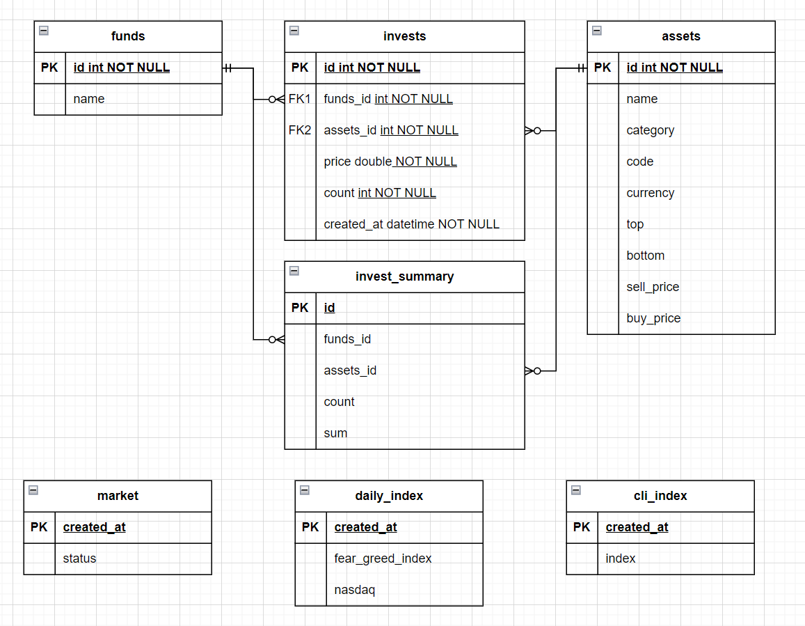

# 투자 포트폴리어 관리 서버


## 개요

사전에 정한 규칙에 맞추어 자산을 관리할 수 있도록 도와주는 프로젝트입니다. 자금의 종류를 나누어, 자금별로 독립적으로 관리될 수 있도록 합니다. 시장 상황과 종목 가격에 따라 매수/매도 규칙을 정하고, 규칙이 부합되었을 때 이행 할 수 있도록 보조하는 역할을 수행합니다. 이를 위해서 프로젝트는 크게 3가지 작업을 수행합니다. 

1. 투자 기준이 되는 정보 저장 
2. 관심 종목을 지속적으로 확인하여, 투자 행동별 기준에 부합되었을 때 알림 전송 
3. 현재의 자산 및 투자 이력 관리


**투자 기준 정보 저장**

우선, 종목의 매수/매도 수행의 기준이 되는 정보를 저장합니다. 기준이 되는 정보는 1.시장 상황 2. 종목 정보입니다.

시장 상황은 총 5단계로, 큰 하락 예상, 하락 예상, 변동 구간, 상승 예상, 큰 상승 예상으로 구분합니다. 각 단계별 변동 자산 비중은 다음과 같이 유지됩니다.

| 단계          | 1            | 2         | 3         | 4         | 5    |
| ------------- | ------------ | --------- | --------- | --------- | ---- |
| **시장 예측** | 큰 하락 | 하락 | 변동 | 상승 | 큰 상승 |
| 변동 자산 비중 | 20~30% | 30~40% | 40~50% | 50~60% | 60~70% |

시장의 단계는 직접 저장합니다. 다만, 시장 단계 파악에 도움이 되는 공포탐욕지수, CLI Index 정보를 매일 갱신해두어, 조회할 수 있도록 합니다.


종목 정보는 투자 대상으로 보고 있는 종목의 정보로, 이름, 구분, 통화, 고점, 저점, 기준 매도가, 기준 매수가를 가집니다. 이때, 기준 매도가와 기준 매수가는 optional한 정보입니다.

종목 구분은 다음의 카테고리로 관리합니다. 이중 4단계 이후를 변동 자산으로 취급합니다.

| 카테고리 | 1    | 2    | 3    | 4        | 5       | 6        | 7        | 8        | 9       | 10       |
| -------- | ---- | ---- | ---- | -------- | ------- | -------- | -------- | -------- | ------- | -------- |
| 의미     | 현금 | 달러 | 금   | 단기채권 | 국내ETF | 국내주식 | 국내코인 | 해외주식 | 해외ETF | 레버리지 |


**투자 행동 알림**

투자한 종목들에 대해 현재가를 주기적으로 확인하고 투자 행동 기준에 충족되는지 확인합니다.


우선, 시장 상황에 따라 자금별 변동 자산 비중 관리 알람을 전송합니다. 

특정 자금이 현재 시장 단계의 변동 자산 비중을 초과한 경우, 해당 자금의 매도 알림이 갑니다. 알림에는 해당 자금의 포트폴리오와 보유한 목록을 우선 처분 대상 순서대로 정렬하여 전송합니다. 

특정 자금이 현재 시장 단계의 최소 변동 자산 비중을 미달한 경우,  전체 종목 목들을 우선 구매 대상 순서대로 정렬하여 전송합니다.

:bulb: 우선 처분 기준 : 현재가가 고점 및 EMA200 보다 높을 수록 우선 처분

:bulb: 우선 구매 기준 : 현재가가 고점 및 EMA200 보다 낮을 수록 우선 구매


또한, 종목의 기준 가격에 따라 중목 매도/매수 관리 알람을 전송합니다. 

기준 매도가가 있을 경우, 종목의 현재가가 기준 매도가보다 높아질 때 매도 알람을 전송합니다. 기준 매도가가 없을 경우, 매도 미대상으로 분류합니다. 다만, 변동 자산 비중이 넘어 갔을 경우, 고점보다 현재가가 높은 자산이 우선 처분 대상이 됩니다. 

기준 매수가가 있을 경우, 종목의 현재가가 기준 매수가보다 낮아질 때 매수 알림을 전송합니다. 기준 매수가가 없을 경우, 저점이 기준 매수가가 됩니다.


**현재의 자산 및 투자 이력 관리**

현재 자산 정보를 조회하고, 투자 이력 정보를 저장합니다. 

행동 알림에 따라 매수/매도를 수행한 경우, 수행한 이력을 저장합니다. 저장된 이력은 현재 자산 정보, 투자 행동 알림의 보유 종목, 변동 종목 비중 등에 사용됩니다. 


## 설계

### 작업별 요구사항

#### 투자 기준 정보 저장

- [x] 현재 시장 단계 저장
  - [x] 현재 시장 단계 저장 API (입력: 현재 단계)
    - 입력으로 온 현재 단계 값이 1~5의 정수인지 검증
  - [x] 시장 상태 조회 API (출력 : 현재 단계, 변동 자산 비중, 공포탐욕지수, ~~CLI Index, CLI Index 연속 상승/하락 정보, 나스닥 연속 상승/하락 정보~~)

- [x] 종목 정보 저장
  - [x] 종목 정보 저장/갱신 API (입력 : 이름, 구분, 통화, 기준 매도가, 기준 매수가 )
    - 입력으로 온 구분 값이 카테고리 값인지 검증
    - 고점, 저점은 자체 크롤링으로 정보 조회하여 저장
    - 기준 매수가 미존재 시, 저점값 사용
  - [x] 종목 정보 개별 조회
  - [x] 종목 리스트 조회 (통화, 투자된 총액 같이 조회)
  - [x] 종목 정보 삭제


#### 투자 행동 알림

- [x] 보유하고 있는 종목에 대한 현재가 크롤링
  - [x] :heavy_exclamation_mark: 종목 정보를 가지고 동적으로 현재가 정보를 가져올 수 있는 기능 필요 (가능한 사이트 사전 탐색)
    - 주식/ETF => 한국투자증권 API
    - 코인 => upbit API
- [x] 갱신된 현재가로 현재 시장 상태의 변동 자산 비중을 초과했는지 여부 확인
- [x] 초과 시 알림 전송 (전송 정보 : 시장 상태, 최대 변동 자산 비중, 자금 ID, 자금의 현재 변동 자산 비중, 자금 포트폴리오, 우선 처분 대상 종목)
- [x] 갱신된 현재가로 매도/매수 기준 충족 여부 확인 (매수/매도 기준가에서 10%씩 더 벗어날때마다 알림)
- [x] 충족 시 알림 전송 (전송 정보 : 종목 이름, 종목 구분, 통화, 고점, 저점, 기준 매도가, 기준 매수가, 현재가)
  - [x] (추가) 자금별 사용 가능 금액
  - [x] 한번 알림 후 buy/sell price이 변동있긴 전까진 알림 전송 X (두 가격 각각에 대한 알림 전송 여부 필요)
- [x] 매일 시장 상태 관련 정보 알림 전송


#### 현재의 자산 및 투자 이력 관리

- [x] 현재 자산 정보를 조회
  - [x] 1.전체 자금 총액 2.자금 종목현황 3.자금 투자이력
  - [x] 1.전체 종목 총액 2.종목 총액 3.종목 투자이력 4.종목 정보 정보투자기준 관리
- [x] 투자 이력 저장 (입력 : 자금Id, 종목 Id, 현재가, 개수)
  - [x] 현금 충전


#### 공통

- [x] 자금을 n개 영역으로 나누어 관리
  - ex) 3분할 : 공통자금, 퇴직자금, 개인투자자금
- [x] 로그인, API KEY 정보는 암호화해서 DB 저장. 서버에서 복호화해서 사용


### 패키지 설계

- app
  - 개요
    - 사용자 요청을 처리하는 서버
    - API 담당
  - 기능
    - 자산 현황 조회/신규 등록
    - 투자 이력 저장
    - 종목 정보 저장/갱신/삭제/조회
    - 현재 시장 단계 저장

- bot

  - 개요
    - 생성한 telegram bot과 연동되어, client와 서버 간 소통 담당

  - 기능
    - 서버 리부팅 시, 복호화 키 요청
    - event 패키지에서 전달된 알림을 전송
    - http request 대리 수행

- db

  - 개요
    - database 저장, 갱신, 조회, 삭제 담당
  - 기능
    - app, event에서 사용할 자금, 종목, 시장 정보들에 대한 CRUD

- event

  - 개요
    - 시장 단계, 종목 정보, 종목 현재가를 조합하여, 투자 행동 알림 전송
  - 기능
    - 변동 자산 비중 초과 알림 / 최소 비중 부족 알림
    - 매도/매수 알림
    - 부동산 상태 변화 체크

- model
  - 개요
    - 패키지들에서 공통적으로 사용할 타입/변수 정의

- scrape

  - 개요
    - 인터넷 크롤링, API 호출을 통해서 현재가와 같이 변하는 정보 수집
  - 기능
    - 크롤링 : url, css path 입력받아 타겟 정보 반환
    - API 호출 : url, header 입력받아 api 호출 결과 반환

  

  

### API 설계

- 자금 (`/funds`)
  - 전체 현황 조회 (`GET` : `/` )
  - 신규 자금 추가 (`POST` : `/`)
  - 자금 투자 이력 (`GET` : `/:id/hist`)
  - 자금 종목별 총액 조회 (`GET` : `/:id/assets)`
- 종목 (`/assets`)
  - 종목 정보 저장 (`POST` : `/`)
  - 종목 정보 갱신 (`POST` : `/:id`)
  - 종목 정보 삭제 (`DELETE` : `/:id`)
  - 종목 정보 조회 (`GET` : `/:id`)
  - 종목 목록 조회 (`GET` : `/list`)
  - 중목 투자 이력 조회  (`GET` : `/:id/hist`)
- 시장상태 (`/market`)
  - 시장 단계 저장 (`POST` : `/`)
  - 시장 상태 조회 (`GET` : `/` )
  - 시장 지표 조회 (`GET` : `/indicators` )
  
- 투자(`/invest`)
  - 내역 저장 (`POST` : `/`)


### 모델링




:memo: **EMA 계산 수식**

```
SMAt = (PRICEt - SMAy)/ N+1 + SMAy

a =  2/N+1
EMAt = a*PRICEt + (1-a)EMAy
```


초기값은 SMA값 사용 : :link:https://www.barchart.com/stocks/quotes/AAPL/technical-analysis#google_vignette


## 작업 기록


### Mock 설정

- 설치 및 생성

    ```sh
    go install github.com/vektra/mockery/v2@v2.44.1
    go generate ./...
    ```

- 주석으로 대상 지정
  - `//go:generate mockery --name {interface name} --case underscore --inpackage`

- 일괄 행동 정의
  - mockery는  mock의 메소드별 행동을 명시적으로 정의해야 함.
  - 모든 메소드에 대해서 행동을 지정하기 위해서는 reflect를 사용하여 모든 메소드들을 loop 돌면서 지정 가능

    ```go
    ref := reflect.TypeOf(MyInterface)
    for i :=0; i < ref.NumMethod(); i++{
        method := ref.Method(i)
        mockObj.On(method.Name).Return(nil)
    }
    
    ```


### mysql설정

- docker container

```sh
$ docker run -v /invest/db:/var/lib/mysql --name investDb -e MYSQL_ROOT_PASSWORD=root -d -p 3306:3306 mysql --character-set-server=utf8mb4 --collation-server=utf8mb4_unicode_ci
```

:bulb: root 계정은 기본값으로 localhost로부터의 연결만 가능

- `{계정}`@`%` 생성 : `%`는 wildcard로 모든 ip에 대해 응답 가능 설정

- schema 및 초기 세팅

  ```bash
  docker exec -i -t 컨테이너이름 bash
  mysql -u root -p # 이후 비밀번호 입력
  SHOW DATABASES;
  CREATE SCHEMA {스키마} DEFAULT CHARACTER SET utf8;
  USE {스키마}
  ```

  

### go 설정

- ~/.profile 설정

    ```sh
    export GOROOT=/usr/local/go 
    export PATH=$PATH:$GOROOT/bin
    export GOPATH=$HOME/go 
    export PATH=$PATH:$GOPATH/bin
    ```

    `. ./.profile` 로 즉시 적용

- `GOMODCACHE` 설정
  
  - `go env -w GOMODCACHE=$HOME/golang/pkg/mod`

:bulb: GOROOT VS GOPATH VS GOMODCACHE

- GOROOT : Go의 본거지로, Go관련된 실행파일, SDK 등이 위치
- GOPATH : `go get` 명령으로 받아오거나 자신이 직접 작성하는 모든 Go 프로젝트와 라이브러리가 이곳에 위치
- GOMODCACHE : Go Modules cache 위치하는 장소


### 포트 개방

https://generalcoder.tistory.com/29


### HTTP vs HTTPS

| HTTP                                                      | HTTPS                                                       |
| --------------------------------------------------------- | ----------------------------------------------------------- |
| 데이터가 암호화되지 않은 상태로 전송                      | SSL/TLS(보안 프로토콜)를 사용하여 데이터를 암호화한 후 전송 |
| 데이터를 제3자가 가로챌 경우, 그 내용을 쉽게 읽을 수 있음 | 데이터를 가로채도 내용을 읽을 수 없음                       |
| SSL/TLS 인증서를 사용 X                                   | SSL/TLS 인증서를 사용하여 통신을 암호화                     |

