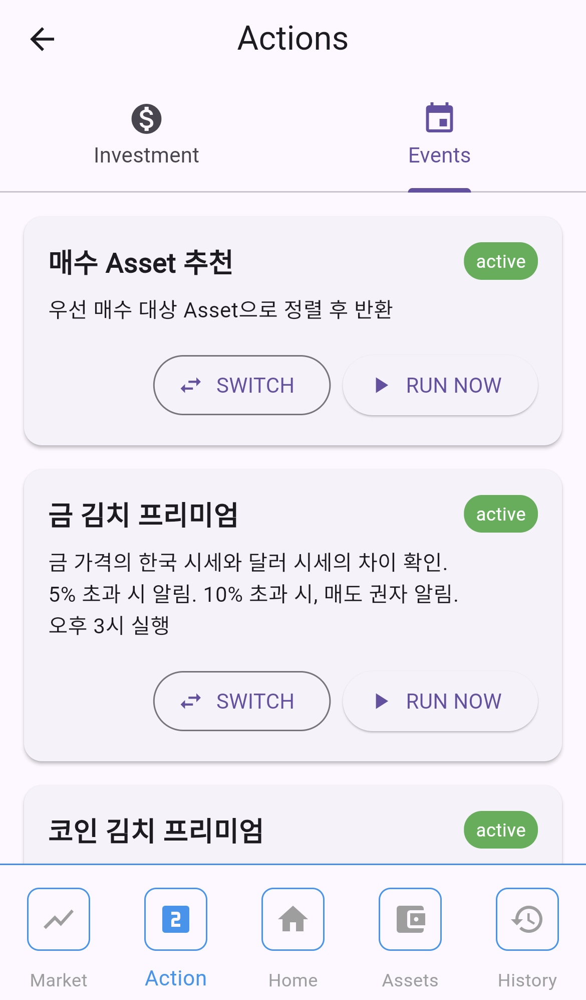
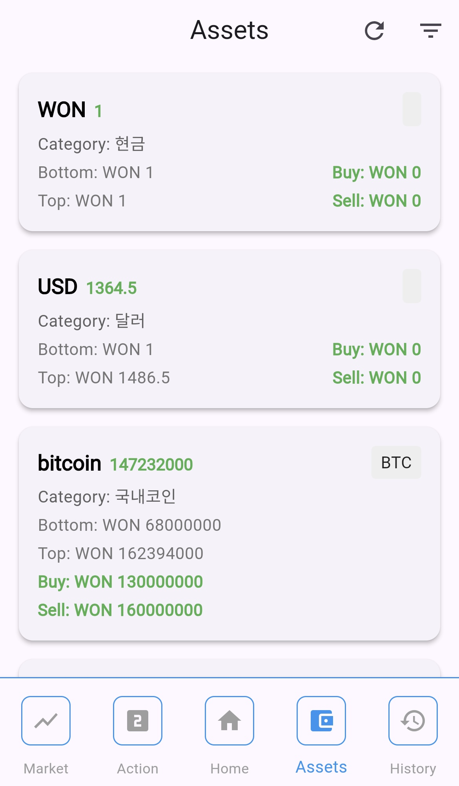
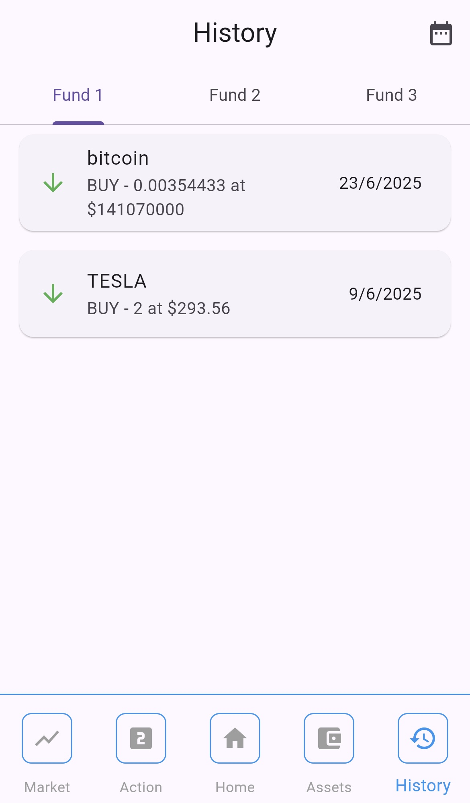

# invest_application

[invest_indicator](https://github.com/ChoSanghyuk/invest_indicator) 를 backend 서버로 사용하는 flutter app입니다.

주요 화면으로는 다음과 같이 있습니다.

## Home

- 자산별 총액
- 자산별 안전 자산 / 위험 자산 비율
- 자산별 투자 현황

## Market

- 현재 시장 단계 조회 및 변경
- 주요 시장 지표 그래프

## Action

### Invest

- 투자 내역 저장

### Events

- 서버에 등록된 이벤트 (배치성 작업) 조회
- 이벤트 즉시 실행
- 이벤트 on/off

## Assets

- 주요 관심 종목 조회 / 등록 / 수정
- 목표 구입 가격 및 판매 가격 설정

## History

- 자산별 투자 이력 조회
