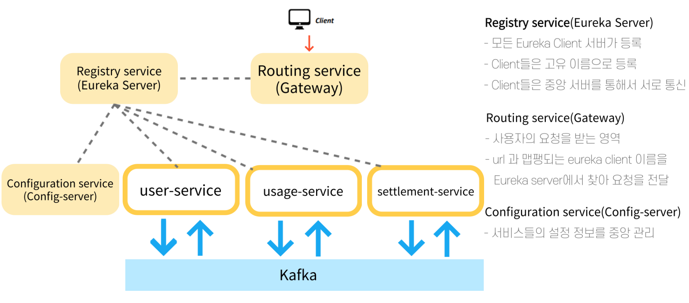
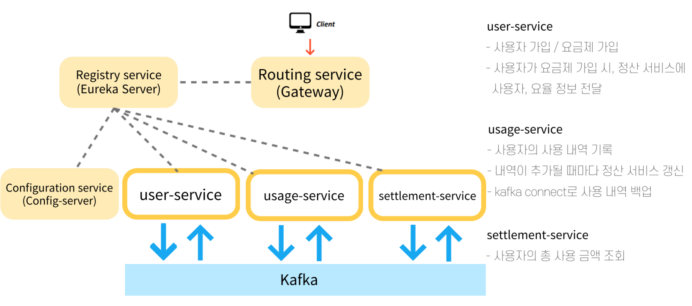

# MSA 기반 단순 빌링 시스템 구현

## 프로젝트 소개

| 카테고리 | 설명                                                         |
| -------- | ------------------------------------------------------------ |
| 목표     | 단순화 시킨 가입, 과금, 정산 시스템을 MSA 모델로 구현        |
| 시작동기 | 총 3번의 발표 중 2번째 진행했던 MSA 관련 내용을 직접 구현해보고자 함 |
| 사용기술 | ▮ java ▮ spring ▮ spring-cloud ▮ Apache-Kafka ▮ JPA ▮ h2     |
| 기간     | 2022.05 ~ 2022.05                                            |
| 진행상황 | - Eureka Server로 마이크로 서비스의 등록 및 검색 - Gateway로 Clinet의 요청을 마이크로 서비스로 전달 - 사용자 가입, 사용 금액 과금, 총 사용 금액 정산 서비스를 마이크로 서비스로 분리 - Kafka Pub/Sub을 통한 가입, 과금, 정산 서비스 간 통신 |

## 프로젝트 개요

### Gateway, Eureka, Config

### User, Usage, Settlement Service

## 느낀점 및 배운점

- MSA 구조에서의 독립적인 서비스들의 운영 및 오케스트레이션에 대해 이해할 수 있었다. 마이크로 서비스들을 Eureka 서버에 등록시킴으로 Client는 Gateway의 url 한 곳에만 요청을 보내어도, 독립적인 서비스들에 요청보내는 효과를 가져올 수 있음을 알 수 있었다.
- 추가로, Kubernetes를 통한 Gateway에서의 요청 여부를 마이크로 서비스가 인증하는 로직과 트래픽에 따른 서비스 증감에 대해 학습할 필요성을 느꼈다.

